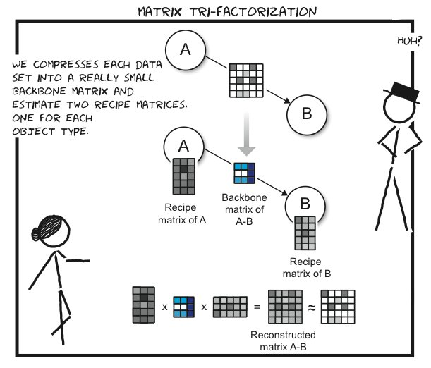
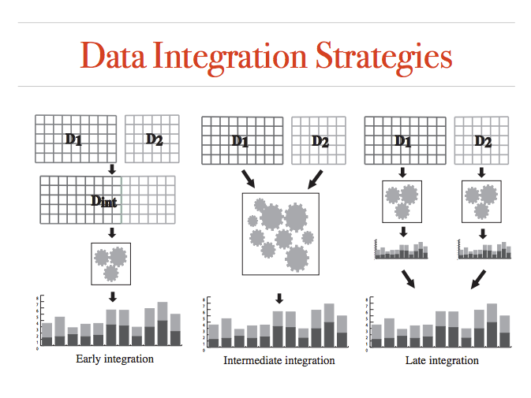

# Jumping across biomedical contexts using compressive data fusion

## by Marina Zitnik Blaz Zupan

発表者 国立癌センター 宮本 丈

---

## subtitle

hogehoge

---

# 先行研究

## 同著者によるもの

* Data fusion by Matrix factorization. Zitnik,M Zupan,B, 2015
Medusa の使用しているアルゴリズムの基礎。
* Gene Prioritization by Compressive Data Fusion and Chaining
* Discovering disease-disease associations by fusing systems-level molecular data

* Fusjishage 2005 Submodule functions and optimization.
教科書

---

# 関連研究

大きく2つの流派がある

1. meta-path-based アプローチ ... Heterogeneous Network Edge Prediction: A Data Integration Approach to Prioritize Disease-Associated Genesなど
2. latent-chain-based approach ... この著者

様々な種類のデータセットからgroup wise disease-assosiationを抜き出す研究には色々ある。

* A DIseAse MOdule Detection(DIAMOnD) ... network propagation and random walk analysis でdisease gene とタンパク質複合体都の関係を予想
* guilty by association methods ... RIDDLE など。cofunction network から機能未知の遺伝子の機能予測

---

# 先行研究との違い

先行研究は皆この著者自身のものも含めて、「異なった、場合によっては距離のあるsemanticsを考慮に入れた、遺伝子・病気関連解析」ではない。また、ユーザーが遺伝子、病気の関係を選択結合することがデキるものもない

---

# メソッド

---
目的: あらかじめ設定したpivot objectと優位に関連するsize-kのモジュールを作成する。

data fusion graph G=(V,R,T)

* V ... nodes(ontology term, gene, disease, pathway, chemicalなど)
* R ... edge(データ・セット。行・列はそれぞれノード同士の関係を表す。)
* T

---

# Collective Matrix factorization

G = (V,R,T)を引数に取り、圧縮された推測された潜在空間モデルの行列を出力する
行列Rとともにco-factrizationを行うことで達成する。Tはモデルの正則化のために利用する。

以下を満たす手法を使う

1. *related matrices*間の情報伝達が可能
2. high-quality data compressionによるよい一般化(?)

目標となる低次元マトリックスを$G^I, I \in V$と$S^{I,J}, I,J \in V$すると最小化すべき関数は

$$
(1)
$$

となる。

パラメータは...
より詳しくはData Fusion by ... を参照

---

# Data fusion by Matrix factorization

fusion dataからのデータマイニング手法は大きく3段階で発展してきた.

1. 単一の特徴量行列にマージし、なんでも良いのでよく使われる手法を適用する。modular structureを無視, 特徴量生成の方法に大きく依存し、domain specificな知識が要求される。
2. *late decision integraion*それぞれの情報源を元に、それぞれ独立にモデルを生成し、マージする。
3. *intermediate (partial) integration* なんかすごい。

DFMF(Data Fusion Matrix Factorization)の説明をして、その後にその他の関連学習の手法を説明し、最後にカーネル法の説明をする。その後に他の手法との比較をする。特にtri-SPMFと比較する。

---

---

## DFMF

r個のオブジェクトタイプ$\sigma_1, ... \sigma_r$を考える。これには例えば患者とか病気とかが入る。

$\sigma_i$のオブジェクトが$n_i$個あり、jも同様とする。iとjを関連付ける観測行列(スパース)を$R_ij \in \R^{n_i * n_j}$とする。$\sigma_i$に属するデータ同士の関連をconstraint matrixとして表現する。これにはSNSデータやDrugインタラクションが含まれる。

---

# submodular funcion and optimization

計算の最後の段階らしい。優位な関連のあるオブジェクトの組(サブモジュール)を抜き出すのに使うっぽい。例えばKrauseの論文を参照。

n個のオブジェクトVとvaluation function $f: 2^V -> R\_+$を想定する非負値の値を返す。
