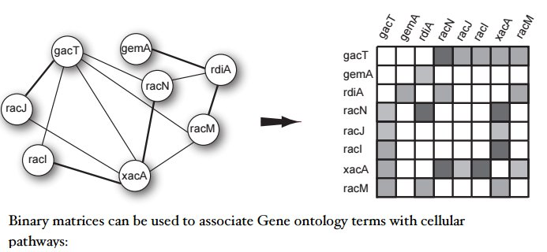
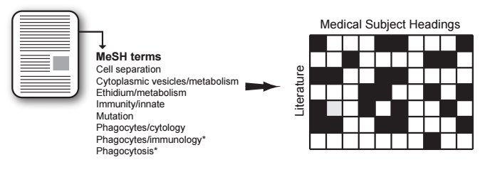
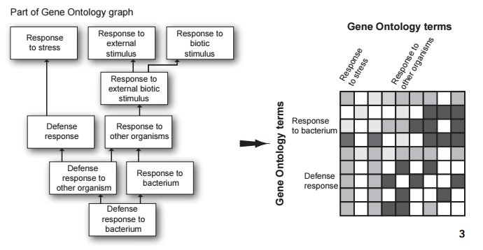

# Jumping across biomedical contexts using compressive data fusion

## by Marina Zitnik Blaz Zupan

 発表者 国立癌センター 宮本 丈 

---

# motivation

特定の形質`A`と優位に相関する遺伝子`B`を見つけたい.

↓ 一般化

特定の型`<A>`のインスタンス`\(a_1, a_2, ... a_n\)`と優位に相関する

型`<B>`のインスタンス`\(b_1, b_2, ... b_n\)`を見つけたい

---

# How ?
## 様々なソースからのデータ群を組み合わせる。

* GO
* KEGG
* MESH
* PUBMED
* GEO
* PUBCHEM
etc ...

---

# How ?
## 質、量ともにカオスに

→ 頑張ってすっきりさせるよ！

---

# 全体の流れ

1. 全部行列に直す(前処理)
2. 関連付ける
3. collective matrix factorization(ここまで先行研究)
4. Medusa

---

# 全体の流れ

1. 全部行列に直す(前処理)
2. 関連付ける
3. collective matrix factorization(ここまで先行研究)
4. Medusa

---

# 1. 行列に直す

### グラフデータ

---

# 1. 行列に直す

### xml

---

# 1. 行列に直す

### GO

---

# 全体の流れ

1. 全部行列に直す(前処理)
2. 関連付ける
3. collective matrix factorization(ここまで先行研究)
4. Medusa

---

# 2. 関連付ける

間接的なデータしかなくとも情報を用いることができる。

---

# 2. 関連付ける

行列の行列として表現できる。

---

# 2. 関連付ける

同じもののグラフ表現

---

# 2. 関連付ける

グラフを`\(G\)`とすると

`\(G = (V, R, T)\)`、ただし

* `\(V\)`は頂点(型)
* `\(R\)`は辺(Relation matrix)
* `\(T\)`は同じ型のオブジェクト間の行列(制限行列) `\(\Theta \in T\)`

---

# 全体の流れ

1. 全部行列に直す(前処理)
2. 関連付ける
3. collective matrix factorization(ここまで先行研究)
4. Medusa

---

# collective matrix factorization

`$$ \sum_{R{ij} \in R} {|| R_{ij} - G_iS_{ij}G_j^{T} ||^2} + \sum_{\Theta \in T^l}{tr((G^l)^T\Theta^lG^l)} $$`

を最小化するような`\(G_i, G_j,S_{ij}\)`を選ぶ。-> 制限付き固有値分解による低ランク近似

semi-surpervised clusteringの一種。「同じ型のオブジェクト同士で、かつ相関のあるオブジェクトは、おそらく同じクラスタに入るはずだ」という事前知識を用いる。

例: SNS上でつながっている人物どうしならば、同じ映画を選好するクラスタに入りやすいはずだ。

選ぶデータによって結果が変わる可能性があるので注意！

---

# matrix tri-factorization
#### 潜在空間にマッピング(クラスタリング)

`\(R\)`→`\(GSG^T\)`

---

# collective matrix factorization
#### 全体に対して適用(先ほどの数式)

---

# collective matrix factorization
#### 行列をチェインさせて任意の2種類のデータの関係を見る

オブジェクトどうしの、本来ならば自明でない関係性が見れてハッピー！

---

# ここまで先行研究

問題点 ...  2頂点間に複数のチェインがあった場合、それらを統合して考えるのはナンセンス。

↓

なぜならばそれらはそれぞれ違った基準での距離を表しているため

↓

統合できたら検出力上がってうれしいよね？

---

# Medusa

---
# 同じ型のオブジェクトどうしでもできる

例: 病気Aと関連のある遺伝子群を持っていて、それに似た遺伝子群をひっぱってきたい

※: 自分の興味のある基準でひっぱってこれるのがミソ(多分)

詳しくは論文を

---

# ポジコンで検証 -> つよい

---

# なぜISMBに通ったか

* 使えそう(需要が多そう)だから
* 関数型言語みたいで美しいから
* 今までの集大成感があるから

---
# 感想

---

# refs

ref: http://helikoid.si/A8BFDCC6-8297-40AE-A9B4-59AA6983BF33/FinalDownload/DownloadId-FD86820B5866BD37D790F1FF903773BF/A8BFDCC6-8297-40AE-A9B4-59AA6983BF33/bc215/bc2-handouts.pdf

http://eprints.fri.uni-lj.si/2862/1/2014-ZitnikZupan-IEEE-TPAMI.pdf
-->
